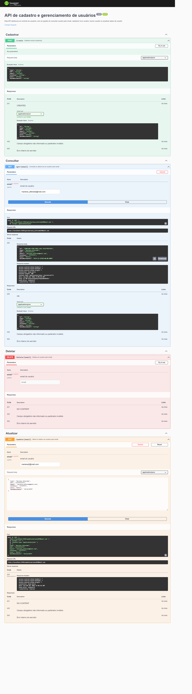
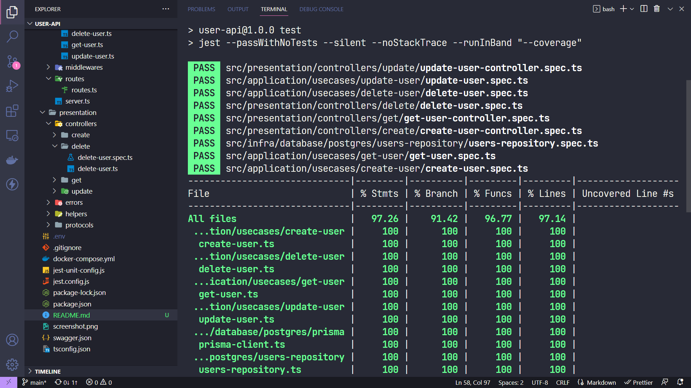

## API com Node, Typescript, Express, PostgreSQL e PrismaORM aplicando TDD, Clean Archtecture e SOLID principles para cadastro e gerenciamento de usuários

### Screenshot

### Construído com

-   Node
-   Typescript
-   Express
-   PostgreSQL

API desenvolvida com Node, Express e Typescript.

Por meio da API, são disponibilizados recursos para as operações de registro de novo(a) usuário(a), consulta de usuário(a) pelo email, exclusão de usuário(a) e alteração de dados de usuário(a).

Foi realizada a documentação via Swagger, conforme a imagem acima, que pode ser acessada pelo endpoint "/api-docs".

Por meio do endpoint "/create", utilizando-se o método HTTP POST, o usuário deve encaminhar no corpo da requisição obrigatoriamente os campos "nome", "CPF", "email", "telefone", "sexo" e "dataNascimento", sendo que o campo "sexo" aceita somente os valores "Masculino", "Feminino" ou "Outro", e o campo "dataNascimento" espera receber uma data no seguinte formato: dd/MM/yyyy.

Caso algum dos parâmetros acima não seja fornecido, é retornada uma resposta 400 BAD REQUEST (MissingParamError).

Além disso, é preciso que o usuário forneça um "email" e um "CPF" que não estejam em uso, caso contrário será retornado um erro informando que o valor já está em uso por outro usuário.

O campo "passwordConfirmation" deve ser o mesmo do campo "password". Se alguma dessas exigências não for observada, é retornada uma resposta 400 BAD REQUEST (InvalidParamError).

Em caso de sucesso, é retornada uma resposta 201 CREATED com os dados do usuário, incluindo ID, no corpo da resposta.

Com o endpoint "/get/:email", utilizando-se o método HTTP GET, o usuário deve fornecer na URL o email.

Caso não seja informado email, ou seja informado em formato inválido, é retornada uma resposta 400 BAD REQUEST, e caso não haja usuário com o email informado, é retornada uma mensagem de "Não foi encontrado nenhum usuário com o email informado".

Em caso de êxito, é retornada uma resposta 200 OK com os dados do usuário, incluindo seu ID.

Para excluir um usuário é preciso utilizar o endpoint "/delete/:email", informando obrigatoriamente o email do usuário a ser deletado.

Caso o email não seja informado ou seu formato seja inválido, é retornada uma resposta 400 BAD REQUEST.

Porém, em caso de sucesso, é retornada uma resposta 204 NO CONTENT e o usuário é excluído do banco de dados.

Por fim, há o endpoint "/update/:email", que também exige o email do usuário na URL, mas também exige os novos dados do usuário a serem informados no corpo da requisição.

Caso algum dos dados não seja informado, ou seja de forma inválida, é retornada uma resposta 400 BAD REQUEST.

Em caso de êxito, é retornada uma resposta 204 NO CONTENT e os dados são atualizados no banco de dados, podendo ser verificado por meio do endpoint "/get/:email".

### Aplicação do TDD (Test-Driven-Development)

Para construção da API foi aplicado o TDD, realizando testes unitários para garantir as funcionalidades dos componentes do sistema, sendo que os arquivos de testes foram alocados próximos aos arquivos de suas implementações.

É possível executar o comando "npm run test:ci" para executar todos os testes e ao final verificar o percentual de cobertura de testes da aplicação inteira.

Cobertura:

### Aplicação da Clean Archtecture

Para estruturação das camadas da API, foram aplicados os princípios da Clean Archtecture desenvolvida por Robert Martin a fim de segregar os componentes em camadas com o intuito de reduzir o acoplamento entre elas.

Na camada mais interna, há o diretório "domain", onde está a modelagem da entidade de Usuário ("UserModel").

No mesmo diretório "domain", na subpasta "useCases", há a definição das interfaces dos casos de uso, responsáveis por realizar operações com as entidades na camada de domínio, com as operações de cadastro, consulta, atualização e exclusão de usuário.

Na camada acima, dentro da pasta "application", em "usecases", há a implementação das interfaces dos casos de uso, divididas em subpastas para cada caso de uso estipulado na camada de domínio, sendo uma para criação de um usuário, outra para consulta de usuário pelo email, outra para exclusão de usuário e outr para atualização de dados de usuário.

Ainda em "application", há a pasta "protocols", onde estão definidas as interfaces dos repositórios, ou seja, das classes responsáveis pela persistência e manipulação do banco de dados.

Após a camada de casos de uso, há a camada de "presentation", onde se situam os "controllers", que intermediam as requisições e respostas vindas e encaminhadas ao exterior da aplicação, delegando as operações e retornando uma resposta ao(a) usuário(a).

Nesta camada, há a pasta "presentation", e a subpasta "controllers", onde constam os controladores responsáveis por validar os campos obrigatórios da requisição, caso houver, delegar as atividades aos respectivos casos de uso, e formatar a resposta para o usuário em caso de sucesso ou de falha, além de tratar erros.

Mais externamente, há a camada de "infra", referente à infraestrutura, onde se situam os componentes de mais "baixo-nível" da aplicação.

É nesta camada ("/infra/database/postgres") onde foi implementado o banco de dados PostgreSQL para implementação das interfaces dos repositórios, com o suporte do ORM Prisma.

Por último, há a camada principal ("main"), onde está configurada a aplicação e são instanciadas e injetadas as dependências das implementações das outras camadas.

Há também a implementação de "adapters" para adaptar requisições e respostas do formato do framework "Express" para um formato menos específico, que será encaminhado para as camadas mais internas da aplicação, evidenciando que o framework utilizado não é conhecido pelas camadas de mais "alto-nível".

Nesta camada, é configurada a classe de inicialização da aplicação, utilizando o framework "Express", localizada em "/main/config/app.ts", sendo as rotas definidas na pasta "routes".

### Aplicação dos SOLID principles

Os SOLID principles consistem em práticas consolidadas no âmbito da programação orientada a objetos visando a construção de aplicações com menor acoplamento e maior coesão.

No caso desta aplicação, foram aplicados em maior grau os princípios Single Responsability, Liskov Substitution, Dependency Inversion e Interface Segregation.

O princípio Single Responsability defende que cada classe possua apenas uma razão para ser modificada, ou seja, que possua uma única responsabilidade, e foi com base nisso que se optou por dividir cada funcionalidade da aplicação em um caso de uso distinto.

No caso da persistência ou obtenção de dados, essa responsabilidade ficou apenas com os repositórios, de modo que quando necessário os casos de uso apenas chamarão a implementação dos repositórios, que cuidarão da persistência e acesso ao banco de dados.

Dessa forma se reduz o acoplamento e facilita a manutenibilidade do sistema, facilitando uma eventual troca de um banco de dados por outro.

Quanto aos princípios Liskov Substitution e Dependency Inversion, ambos buscam alcançar um menor acoplamento entre componentes da aplicação, isso porque o primeiro defende que seja possível trocar implementações de mais baixo-nível sem que isso comprometa a funcionalidade mais alto-nível, enquanto que o segundo recomenda que os componentes de mais alto-nível dependam apenas da abstração de componentes de baixo-nível, e não de suas implementações.

No caso, as classes dos controllers e useCases possuem dependências, que são injetadas por seus construtores, sempre como interfaces.

Dessa forma, é possível alterar a implementação destas interfaces no momento de injetar a dependência sem que isso comprometa a funcionalidade dos componentes de mais alto-nível, já que todas as implementações obrigatoriamente seguirão a definição da interface, reduzindo acoplamento. 

Por conta da divisão em camadas seguindo os princípios da Clean Architecture, as camadas de mais alto-nível não conhecem e nem dependem das implementações das camadas mais externas.

Quanto ao princípio da Interface Segregation, optou-se por particionar as funcionalidades dos repositórios em interfaces individualizadas a fim de facilitar sua testabilidade na realização de testes unitários, além de uma maior flexibilidade no momento de implementar e injetar as implementações como dependências.

## Execução

Para executar a aplicação localmente, é preciso primeiro iniciar o container docker com a instância do PostgreSQL, onde são persistidos os dados.

Para isso é preciso, com o docker em funcionamento, executar no terminal o comando "docker-compose up".

Depois, será necessário instalar as dependências executando o comando "npm install".

Após, será preciso executar o Prisma para criar a tabela no banco de dados conforme as migrations configuradas, executando "npx prisma migrate dev".

É possível executar o "npx prisma studio" para visualizar no navegador as tabelas do banco de dados geradas.

Então, é necessário executar "npm run dev" para executar a aplicação em modo de desenvolvimento, sendo possível consumir os endpoints por um http client como Postman ou Insomnia.

Para executar a aplicação em modo de produção, é preciso executar "npm run build" para executar a transpilação do projeto de Typescript para Javascript, e então executar "npm start".

Para visualizar a cobertura de testes, é possível executar "npm run test:ci".

## Autor

-   GitHub - Vinícius dos Santos Verissimo (https://github.com/viniciusdsv93)
